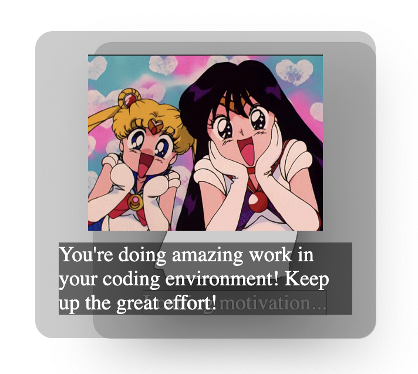
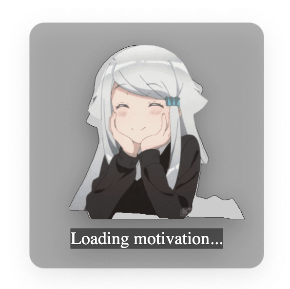

# Overlay Spirit 🦄


Overlay Spirit is an Electron app that displays motivational messages based on screen content. It captures screenshots, sends them to an AI for analysis, and displays the AI-generated motivational messages on your screen. Perfect for keeping your spirits high while you work! 🚀

## Features ✨

- **Motivational Messages**: Get AI-generated motivational messages based on your screen content.
- **Anime Character**: Displays a cute anime character to cheer you up.
- **Log Messages**: View log messages from the main process.
- **Customizable**: Easily update the anime character and motivational quotes.

## Installation 🛠️

1. **Clone the repository**:
    ```bash
    git clone https://github.com/Rahul-Sahani04/overlay-spirit.git
    cd overlay-spirit
    ```

2. **Install dependencies**:
    ```bash
    bun install
    ```

3. **Set up environment variables**:
    - Create a new file named `.env` in the root directory.
    - Add your GitHub token:
      ```env
      GITHUB_TOKEN=your_github_token
      ```

## Usage 🚀

1. **Start the application**:
    ```bash
    bun run start
    ```

2. **Build the application**:
    ```bash
    bun run build
    ```

## Project Structure 📂

```
overlay-spirit/
├── LICENSE
├── README.md
├── index.html
├── main.js
├── preload.js
├── package.json
├── .env.example
├── .gitignore
└── overlay-spirit-darwin-arm64/
    ├── LICENSE
    ├── LICENSES.chromium.html
    ├── overlay-spirit.app/
    │   ├── Contents/
    │   │   ├── Frameworks/
    │   │   ├── Info.plist
    │   │   ├── MacOS/
    │   │   ├── PkgInfo
    │   │   └── Resources/
    └── version
```

## Screenshots 📸

<p align="center">
  
  
</p>

<!-- 

 
-->

## Development Status 🚧


## Contributing 🤝

Contributions are welcome! Please open an issue or submit a pull request.

## License 📄

This project is licensed under the MIT License. See the LICENSE file for details.

## Acknowledgements 🙏

- [Electron](https://www.electronjs.org/)
- [OpenAI](https://www.openai.com/)
- [Bun](https://bun.sh)

---

Made with ❤️ by [Rahul Sahani](https://github.com/Rahul-Sahani04)